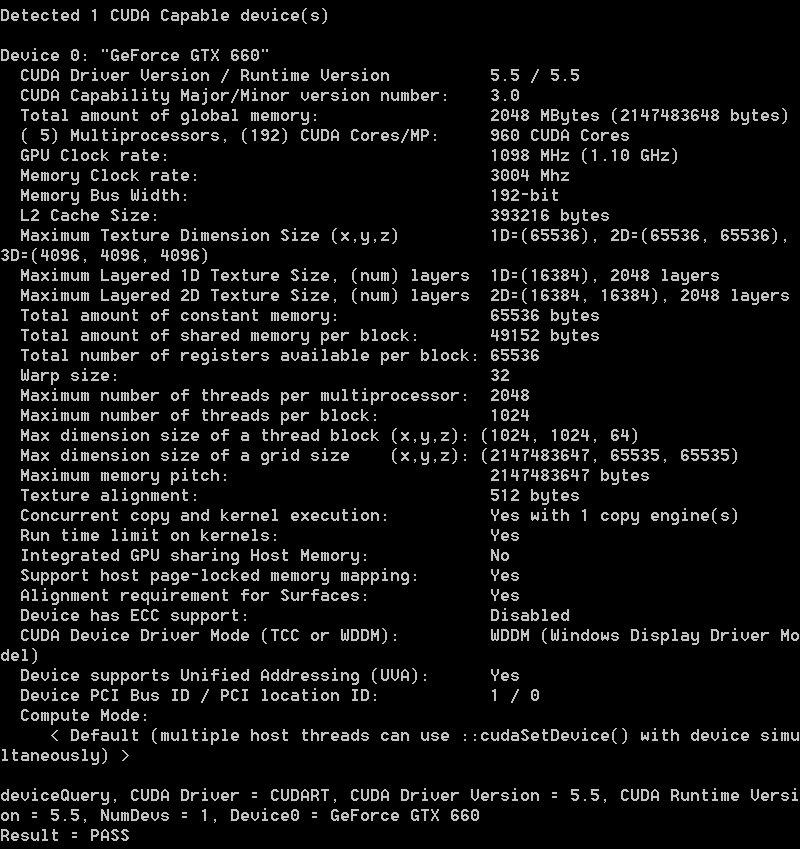
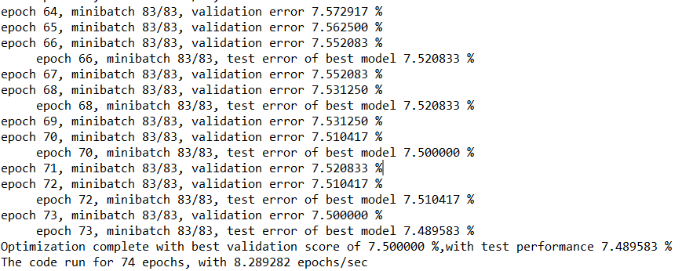


## anaconda+theano+cuda+vs2012编程环境搭建 ##

### 一 基本概念介绍 ###

#### 1.1. anaconda： ####
  一个python科学计算发行版，具体可以参考下面的网页：
  [目前比较流行的python科学计算发行包](http://blog.csdn.net/rumswell/article/details/8927603)。其中比较了python(x,y),winpython, anaconda, canopy, sage。
#### 1.2. theana：####
深度学习python包。
  - [theano github地址](https://github.com/Theano/Theano)
  - [theano 官方首页](http://deeplearning.net/software/theano/)
  - [theano 学习指南翻译](http://www.cnblogs.com/xueliangliu/archive/2013/04/03/2997437.html)
  
#### 1.3. cuda: ####

nvidia gpu编程库

### 二 安装流程 ###
####2.1	我的安装环境  
windows7 64bit. gpu是geforce gtx 660.

#### 2.2 cuda安装 ####
先安装cuda. 目前cuda的最新版是5.5，直接到官方网站下站即可。
  - [cuda 下载地址](https://developer.nvidia.com/cuda-downloads)
  - [手把手教你cuda5.5与VS2010的编译环境搭建](http://blog.csdn.net/yeyang911/article/details/17450963)  
 
下载完后直接傻瓜安装。在我的机器上，我将其安装到"D:\NVIDIA\CUDA"目录。
安装完后，还要设置一些环境变量：
    
    CUDA_PATH   D:\NVIDIA\CUDA\CUDAToolkit
    CUDA_BIN_PATH　　%CUDA_PATH%\bin
    CUDA_LIB_PATH　　%CUDA_PATH%\lib\x64
    CUDA_SDK_PATH　　D:\NVIDIA\CUDA\CUDASamples
    CUDA_SDK_BIN　　%CUDA_SDK_PATH%\Bin\win64
    CUDA_SDK_LIB　　%CUDA_SDK_PATH%\common\lib\x64
    PATH   %CUDA_BIN_PATH%

   安装结束后，可以验证一下cuda是否成功
cd %CUDA_SDK_PATH%\Bin\win64\Release

执行deviceQuery.exe 和 bandwithTest.exe

ok, cuda安装成功

#### 2.3 cuda+vs ###
再接着按照上面教程所说，继续安装vs2010.
cuda官网上有一篇安装教程：
[cuda+vs官网安装](http://docs.nvidia.com/cuda/cuda-getting-started-guide-for-microsoft-windows/)

安装完后，根据下面文章的提示，还要设置一下nvcc.profile.
[Why can't nvcc find my Visual C++ installation?](http://stackoverflow.com/questions/2760374/why-cant-nvcc-find-my-visual-c-installation)

Include this line
    compiler-bindir = C:\Program Files (x86)\Microsoft Visual Studio 9.0\VC\bin
in
    %CUDA_BIN_PATH%\nvcc.profile

一开始，我安装是vs2010 express版本。
但是在编译cuda sample时，
例如这个例子： %CUDA_SDK_PATH%\1_Utilities\bandwidthTest
用win32平台编译没有问题，可以正确执行，但是在clean操作时，会出现下面的错误。
会出现错误： nvcc : fatal error : nvcc cannot find a supported version of Microsoft Visual Studio. Only the versions 2008, 2010, and 2012 are supported

经查，据网上说，是因为vs2010 express默认是不支持64bit编译的，所以可以参考下面两篇文章的介绍进行修复:
https://devtalk.nvidia.com/default/topic/570348/windows-7-64bit-installation-weird-problems-/
http://msdn.microsoft.com/en-us/library/vstudio/9yb4317s%28v=vs.110%29.aspx
我这样做了，但是仍然没有弄好。可能是哪里有疏漏。直接的做法是：那就不装express版本，直接改装ultimate版吧。

下载vs2012 ultimate版，无需激活。
[vs2012下载地址](http://www.edencx.com/visualstudio2012.html)

vs2012安装完成后，打开bandwidthTest，还有一点错误：
说在这个目录下"C:\Program Files (x86)\MSBuild\Microsoft.Cpp\v4.0\V110\BuildCustomizations"找不到CUDA 5.5.props
经过搜索，发现在D:\NVIDIA\CUDA\CUDAToolkit\extras\visual_studio_integration\MSBuildExtensions目录下有这个文件，于是把这个目录下的所有文件都拷到VS的BuildCustomizations目录下。

这样总算可以完整编译bandwidthTest工程，x64和win32平台都是ok的。

#### 2.4 anaconda ####
搞好cuda的环境后，再来安装anaconda。
   anaconda的安装相对简单。

#### 2.5 theana ####
安装完anaconda后，再按照下面文章所述安装theano.
  [64位WIN7上成功安装theano,并运行了g++, GPU](http://blog.csdn.net/yeyang911/article/details/16357133)
  [官网上利用anaconda安装theano的介绍](http://deeplearning.net/software/theano/install.html#windows-anaconda)
安装完theano后，还要设置环境变量：PYTHONPATH = D:\Anaconda\Lib\site-packages\theano
PYTHONPATH的含义和sys.path一样，就是python解释器寻找模块的路径。

在使用theano之前，还需要配置theano。
   在home目录下编辑.theanorc.txt

    [blas]
    ldflags =
    [gcc]
    cxxflags = -ID:\Anaconda\MinGW
    [nvcc]
    fastmath = True
    flags=-LD:\Anaconda\libs
    compiler-bindir=C:\Program Files (x86)\Microsoft Visual Studio 11.0\VC\bin
    base_compiledir=path_to_a_directory_without_such_characters
    [global]
    floatX = float32
    device = gpu

### 三. 使用theano ###
#### 3.1 theano using the GPU ####
[官方using the gpu文档](http://deeplearning.net/software/theano/tutorial/using_gpu.html#using-gpu)

下面是一个测试程序：
    from theano import function, config, shared, sandbox
    import theano.tensor as T
    import numpy
    import time
    
    vlen = 10 * 30 * 768  # 10 x #cores x # threads per core
    iters = 1000
    
    rng = numpy.random.RandomState(22)
    x = shared(numpy.asarray(rng.rand(vlen), config.floatX))
    f = function([], T.exp(x))
    print f.maker.fgraph.toposort()
    t0 = time.time()
    for i in xrange(iters):
        r = f()
    t1 = time.time()
    print 'Looping %d times took' % iters, t1 - t0, 'seconds'
    print 'Result is', r
    if numpy.any([isinstance(x.op, T.Elemwise) for x in f.maker.fgraph.toposort()]):
        print 'Used the cpu'
    else:
        print 'Used the gpu'

The program just computes the exp() of a bunch of random numbers. Note that we use the shared function to make sure that the input x is stored on the graphics device.

在我的机器上，使用cpu执行是10多s. 而使用gpu则是0.5s左右。快了20多倍。

    
    from theano import function, config, shared, sandbox, Out
    import theano.tensor as T
    import numpy
    import time
    
    vlen = 10 * 30 * 768  # 10 x # cores x # threads per core
    iters = 1000
    
    rng = numpy.random.RandomState(22)
    x = shared(numpy.asarray(rng.rand(vlen), config.floatX))
    f = function([],
    Out(sandbox.cuda.basic_ops.gpu_from_host(T.exp(x)),
    borrow=True))
    print f.maker.fgraph.toposort()
    t0 = time.time()
    for i in xrange(iters):
        r = f()
    t1 = time.time()
    print 'Looping %d times took' % iters, t1 - t0, 'seconds'
    print 'Result is', r
    print 'Numpy result is', numpy.asarray(r)
    if numpy.any([isinstance(x.op, T.Elemwise) for x in f.maker.fgraph.toposort()]):
        print 'Used the cpu'
    else:
        print 'Used the gpu'

用上面这个程序，GPU执行，只需要0.01s。

#### 3.2 DeepLearningTutorials ####
   下载DeepLearningTutorials

   [DeepLearningTutorials](https://github.com/lisa-lab/DeepLearningTutorials)

   仔细研读里面的文件，开始学习deep learning！

   logistic_sgd.py
   执行结果：
  
